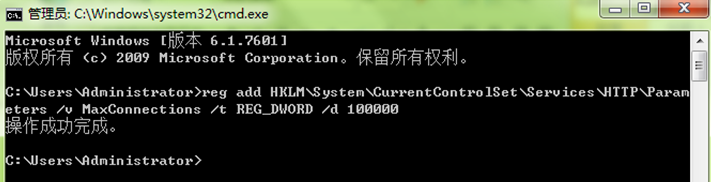

## 目录

1. [谈谈你关于前端优化的经验](#谈谈你关于前端优化的经验)
2. [谈谈如何使用前端缓存](#谈谈如何使用前端缓存)
3. [单个请求数据量过大，如何优化？请做详细描述！](#单个请求数据量过大如何优化请做详细描述)
4. [谈谈css js 加载的顺序对页面性能的影响！](#css-javascript如何压缩引入)
5. [如果页面中图片太多，从性能上来说，如何提高性能？](#如果页面中图片太多从性能上来说如何提高性能)
6. [详解IIS如何调优？](#详解iis如何调优)
7. [谈谈你在之前工作中，有关于后端性能优化的经验！](#谈谈你在之前工作中有关于后端性能优化的经验)
8. [谈谈你了解的缓存](#谈谈你了解的缓存)
9. [请描述Redis的特点](#请描述redis的特点)
10. [谈谈stringbuilder和stringbuffer区别](#谈谈stringbuilder和stringbuffer区别)
11. [谈谈ArrayList和List<>的性能区别](#谈谈arraylist和list的性能区别)
12. [说说 123+”字符串” 和 123.Tostring() 的区别](#说说--123字符串--和--123tostring-的区别)
13. [代码中出现 字符串A.ToUpper()==字符串B 或者 字符串A .ToLower()==字符串B，你会怎么处理？](#代码中出现-字符串atoupper字符串b-或者--字符串a-tolower字符串b你会怎么处理)
14. [代码中出现 strCriteria.Trim() == ""， strCriteria为字符串类型变量； 你会怎么调整？](#代码中出现-strcriteriatrim-strcriteria为字符串类型变量-你会怎么调整)
15. [说说装箱拆箱的为什么会有性能问题](#说说装箱拆箱的为什么会有性能问题)
16. [Object类型使用引发的性能问题，如何解决？](#object类型使用引发的性能问题如何解决)
17. [说说foreach 和 for 循环从性能角度的区别](说说foreach-和-for-循环从性能角度的区别)
18. [在多任务执行的时候，使用多线程，应该注意些什么](#在多任务执行的时候使用多线程应该注意些什么)
19. [在一个网站首页，分为多块的数据，例如：有本周top10，本月top10,个人考勤等！多种数据在首页展示，如果让你来开发，除了使用ajax异步加载，还有什么其他方法能够让数据快速的加载出来？ 请详解开发思路！](#在一个网站首页分为多块的数据例如有本周top10本月top10个人考勤等多种数据在首页展示如果让你来开发除了使用ajax异步加载还有什么其他方法能够让数据快速的加载出来-请详解开发思路)
20. [一个电商系统中，某一些订单的数据，可能来源于第三方接口，也可能来源于缓存，也有可能来源于数据库，如何以最高效的方式获取到数据？请详解你的思路？](#一个电商系统中某一些订单的数据可能来源于第三方接口也可能来源于缓存也有可能来源于数据库如何以最高效的方式获取到数据请详解你的思路)
21. [如果有100个任务需要执行，需要快速的去完成，使用多线程如何实现？是否开启100个线程？为什么？](#如果有100个任务需要执行需要快速的去完成使用多线程如何实现是否开启100个线程为什么)
22. [说说在程序中连接数据库查询，如何避免一些性能问题？](#说说在程序中连接数据库查询如何避免一些性能问题)
23. [谈谈在写sql语句的时候，如何提高性能？](#谈谈在写sql语句的时候如何提高性能)
24. [谈谈数据库的索引！使用索引需要注意些什么？](#谈谈数据库的索引使用索引需要注意些什么)
25. [谈谈数据库分库分表的方式](#谈谈数据库分库分表的方式)
26. [谈谈如何做数据库集群？](#谈谈如何做数据库集群)
27. [谈谈数据库如何配置读写分离？](#谈谈数据库如何配置读写分离)
28. [谈谈你了解到的队列有哪些？](#谈谈你了解到的队列有哪些)
29. [如果一个系统出现性能瓶颈，让你来处理的话，说说你的性能优化计划。](#如果一个系统出现性能瓶颈让你来处理的话说说你的性能优化计划)

### 谈谈你关于前端优化的经验

答：减少http请求数是最重要也是最有效的方法，可以通过以下方法来减少http请求

（1）合理的设置http缓存，恰当的缓存设置可以大大减少http请求。要尽可能地让资源能够在缓存中待得更久

（2）从设计实现层面简化页面，保持页面简洁、减少资源的使用时是最直接的。

（3）资源合并与压缩，尽可能的将外部的脚本、样式进行合并，多个合为一个。

   (4) CSS Sprites，通过合并 CSS图片，这是减少请求数的一个好办法

### 谈谈如何使用前端缓存

答：在前端浏览器中，有些数据（比如数据字典中的数据），可以在第一次请求的时候全部拿过来保存在js对象中，以后需要的时候就不用每次都去请求服务器了。对于那些大量使用数据字典来填充下拉框的页面，这种方法可以极大地减少对服务器的访问。这种方法特别适用于使用iframe的框架。

具体实现思路和方法：

创建一个cache.js文件：前端页面，定义那些数据需要一次性拿到前端缓存，定义一个对象来保存这些数据即可！

### 单个请求数据量过大，如何优化？请做详细描述！

答： 请求压缩，大部分浏览器支持的是：Gzip格式，实现步骤：

1.浏览器请求服务器时，服务器可以获取到浏览器支持的格式；

2.在服务器代码中，加入判断浏览器支持压缩的格式，按照符合的格式压缩请求；

3.返回给浏览器。浏览器可以自行解析。 

### css Javascript如何压缩引入？

答: 可以使用打包工具，比如: YUI Compressor, Microsoft AjaxMin, uglifyjs uglifycss,或者在MVC程序中，可以使用BundleConfig压缩，把多个css,js 集合到某一个包，在项目使用的时候仅仅只需要引入集合包即可！

### 谈谈css js 加载的顺序对页面性能的影响！

答：

1.将 CSS 放在 head 标签里

2.启用 CDN 优化静态资源加载速度

3.合理使用外部 JS 的三种加载方式

正常模式：
 这种情况下 JS 会阻塞浏览器，浏览器必须等待 index.js 加载和执行完毕才能去做其它事情。 

async 模式：
 async 模式下，JS 不会阻塞浏览器做任何其它的事情。它的加载是异步的，当它加载结束，JS 脚本会立即执行。 

defer 模式：
 defer 模式下，JS 的加载是异步的，执行是被推迟的。等整个文档解析完成、DOMContentLoaded 事件即将被触发时，被标记了 defer 的 JS 文件才会开始依次执行。

 

### 如果页面中图片太多，从性能上来说，如何提高性能？

答：

1. 方案一:将图片服务和应用服务分离(从架构师的角度思考)

2. 图片懒加载：像淘宝或者京东这样的APP页面上有很多图片,当我们滑到下一屏时下一屏的图片才会加载,这就采用了图片懒加载的方式.

3. css Sprites：当网站或者APP有大量小icon,如果上传到图片服务器比如CDN, 要加载所有这些小icon将增加大量请求,而CDN是按流量收费的,这无疑将增加很多成本.

CSS Sprites 技术早已不新鲜,就是将这些小icon合并成一张图片,只需要加载一次,每次通过background-position来控制显示icon,这样就可以节约大量请求,节约成本.

### 详解IIS如何调优？

答：

一、一般方案：

1、基本设置

　　[1] 队列长度： 默认值1000，将原来的队列长度改为 65535。

　　[2] 启动32位应用程序：默认值False，改为True， 否则安装一些32的组建或32位的php都会出错。

　　[3] 托管管道模式：Integrated 或 Classsic。 

2、高级设置

　　[1] 闲置超时（分钟）：默认20分钟，修改设长。

　　[2] 快速故障防护 → 已启用 ：默认True，改为False。 

　　

3、解决PEP第一次打开PEP速度慢

　　回收间隔时间

　

　　使用windows server 2008 r2解决回收假死的问题

打开应用程序池 -> 高级设置 ->在“禁止重叠回收”里选择“true”，这样就有效避免了应用程序池回收假死问题。

二．支持同时十万个请求：

1. 调整IIS 7应用程序池队列长度

　　将原来的队列长度由默认值 1000 改为 65535。当然这里的队列长度你可以根据自己的 访问用户*1.5 来设置，例如：有2000用户，此处就可以设置为3000(3000=2000用户数*1.5）。

2. 调整IIS 7的appConcurrentRequestLimit设置

　　由原来的默认5000改为100000。

　　[1] 在cmd中执行：

　　c:\windows\system32\inetsrv\appcmd.exe set config /section:serverRuntime /appConcurrentRequestLimit:100000

　　[2] 在%systemroot%\System32\inetsrv\config\applicationHost.config中可以查看到该设置：

　　`<serverRuntime appConcurrentRequestLimit="100000" />`

　　

3. 调整machine.config中的processModel>requestQueueLimit的设置

　　[1] 单击“开始”，然后单击“运行”，或者 windows + R。

[2] 在“运行”对话框中，键入 notepad %systemroot%\Microsoft.Net\Framework64\v4.0.30319\CONFIG\machine.config，然后单击“确定”。(不同的.NET版本路径不一样，可以选择你自己当前想设置的.NET版本的config)

　　[3] 找到如下所示的 processModel 元素：`<processModel autoConfig="true" />`

　 [4] 将 processModel 元素替换为以下值：`<processModel enable="true" requestQueueLimit="15000" />` 

　　[5] 保存并关闭 Machine.config 文件。
 　由原来的默认5000改为100000。

`<configuration>`

 ` <system.web>`

  `<processModel enable="true" requestQueueLimit="100000"/>`

　

4. 修改注册表，调整IIS 7支持的同时TCPIP连接数

　　由原来的默认5000改为100000。在cmd中执行：

　　reg add HKLM\System\CurrentControlSet\Services\HTTP\Parameters /v MaxConnections /t REG_DWORD /d 100000

　　

　　可在注册表中查看

　　

5. 运行命令使用设置生效

　　`net stop http & net start http & iisreset`

　

### 谈谈你在之前工作中，有关于后端性能优化的经验！

答：代码层面优化，组建高性能Sql,

​     使用内存数据库；

​     使用RDD，弹性分布式数据集 (Resilient Distributed DataSet)

​     增加缓存；

​     使用SSD；

​     使用多线程；

​     分布式部署程序；

 

 

### 谈谈你了解的缓存

答：本地缓存，分布式缓存，Memcache,Redis;Mongodb；

 ### 请描述Redis的特点

​     答：Redis的特点：

内存数据库，速度快，也支持数据的持久化，可以将内存中的数据保存在磁盘中，重启的时候可以再次加载进行使用。

Redis不仅仅支持简单的key-value类型的数据，同时还提供list，set，zset，hash等数据结构的存储。

Redis支持数据的备份，即master-slave模式的数据备份。

支持事务

Redis的优势：

性能极高 – Redis能读的速度是110000次/s,写的速度是81000次/s 。

丰富的数据类型 – Redis支持二进制案例的 Strings, Lists, Hashes, Sets 及 Ordered Sets 数据类型操作。

原子 – Redis的所有操作都是原子性的，同时Redis还支持对几个操作合并后的原子性执行。（事务）

丰富的特性 – Redis还支持 publish/subscribe, 通知, key 过期等等特性。

Redis与其他key-value存储有什么不同？

Redis有着更为复杂的数据结构并且提供对他们的原子性操作，这是一个不同于其他数据库的进化路径。Redis的数据类型都是基于基本数据结构的同时对程序员透明，无需进行额外的抽象。

Redis运行在内存中但是可以持久化到磁盘，所以在对不同数据集进行高速读写时需要权衡内存，因为数据量不能大于硬件内存。在内存数据库方面的另一个优点是，相比在磁盘上相同的复杂的数据结构，在内存中操作起来非常简单，这样Redis可以做很多内部复杂性很强的事情。同时，在磁盘格式方面他们是紧凑的以追加的方式产生的，因为他们并不需要进行随机访问。

 

### 谈谈stringbuilder和stringbuffer区别

 答：我就string, stringbuilder和stringbuffer三者做个比较：  string是基本类型，是不可改变对象，例如：string s1="test";实际上是创建了一个名字为s1的string类型对象，系统为s1创建足够的内存来存储它，s1+="ceshi"，并不是在s1所指向的地址内添加字符串“cehsi”，而是新建了一个“testceshi”字符串并将s1指向这个新的字符串，系统将原来的“test”注销掉，如果频繁的进行字符串的修改会严重影响系统性能。 stringBuilder和string的初始化，string初始化时，系统会为其分配足够的内存来容纳其所定义的字符串文本，但是stringbuilder有很多构造函数来实例化当前实例的初始大小以及可存储的最大字符数，在使用是最好将容量设置为字符串的最大长度，确保他不需要重新分配内存，如果字符的数量超过了设置的最大值，.net运行库将自动分配内存并翻倍，stringbulider可以显示的设置分配内存的大小，而string只能根据初始化字符串的大小由系统来分配足够的内存。在上述情况中，stringbuffer和stringbuilder是一样的，后者速度比前者快，但是后者是线程不安全的，前者是线程安全的。

 

### 谈谈ArrayList和List<>的性能区别

答：ArrayList的每一个Add方法，都需要将数据进行装箱操作，而如果提取的值是值类型又会涉及拆箱动作，而装箱和拆箱是有损性能的。是会耗时的。

 

### 说说  123+”字符串”  和  123.Tostring() 的区别。

答：123+”字符串” 这种方法虽然简单，也可以得到正确结果，但是由于涉及到不同的数据类型，数字需要通过装箱操作转化为引用类型才可以添加到字符串中。使用值类型的ToString方法可以避免装箱操作，从而提高应用程序性能

### 代码中出现 字符串A.ToUpper()==字符串B 或者  字符串A .ToLower()==字符串B，你会怎么处理？

答：字符串比较不区分大小写可优化为：String.Compare(字符串A,字符串B ,true) == 0 或者String.Compare(字符串A,字符串B ,true) == 0 

### 代码中出现 strCriteria.Trim() == ""， strCriteria为字符串类型变量； 你会怎么调整？

答：可调整为：strCriteria.length==0

 

### 说说装箱拆箱的为什么会有性能问题

答：装箱和取消装箱过程需要进行大量的计算。对值类型进行装箱时，必须分配并构造一个全新的对象。内存拷贝，从引用类型转换成值类型，需要从堆拷贝到栈！处理器处理的事情多了，自然引发性能问题。

 

### Object类型使用引发的性能问题，如何解决？

答：可以用泛型替代object的使用；

### 说说foreach 和 for 循环从性能角度的区别

答：对于for循环就是调用get(i)取得元素，而对于foreach是通过iterator实现的遍历，

对于ArrayList来说，它是通过一个数组实现的，可以随机存取；但是LinkedList是通过链表实现的，for循环时要获取第i个元素必须从头开始遍历，而iterator遍历就是从头开始遍历，遍历完只需要一次，所以for循环需要的时间远远超过foreach循环。

 对于数组来说，for和foreach循环效率差不多，但是对于链表来说，for循环效率明显比foreach低。

 ### 在多任务执行的时候，使用多线程，应该注意些什么

答：

1. 是否适合使用多线程；

2. 多线程临时变量问题，

3. 线程数量的控制问题，并不是线程越多越好，线程也是需要系统开销的！

4. 线程安全问题！

 

### 在一个网站首页，分为多块的数据，例如：有本周top10，本月top10,个人考勤等！多种数据在首页展示，如果让你来开发，除了使用ajax异步加载，还有什么其他方法能够让数据快速的加载出来？ 请详解开发思路！

答：可以使用多线程，开启多个任务去获取数据，多个任务执行完毕以后，执行回调函数，就直接返回！既多线程中的执行完毕就执行回调，Task 提供完美Api直接调用！

### 一个电商系统中，某一些订单的数据，可能来源于第三方接口，也可能来源于缓存，也有可能来源于数据库，如何以最高效的方式获取到数据？请详解你的思路？

答：可以使用多线程，开启多个线程任务去获取数据，分别到数据库，缓存，第三方接口去获取数据，只要有一个线程获取到数据以后，就直接返回！既多线程某一个任务执行完毕就执行回调，Task 提供完美Api直接调用！

### 如果有100个任务需要执行，需要快速的去完成，使用多线程如何实现？是否开启100个线程？为什么？

答：100个任务开启100个线程去执行是不合理的，线程越多，系统的线程开销就越大，反而性能得不到保障，可以开启10个线程去执行，某一个线程的任务执行完毕，就紧接着执行下一个任务，线程控制在10个线程即可！可以使用Parallel，同时使用ParallelOptions控制线程数量。

### 说说在程序中连接数据库查询，如何避免一些性能问题？

答：

1. 数据库连接不要频繁的打开和关闭
2. 不要循环数据去查询数据库。
3. 编写简洁的sql语句；
4. 使用的数据源尽量一次性取出，业务逻辑处理由Web服务器处理；
5. 不要一次取出体量太大的数据。
6. 尽量不要使用数据库存储过程。

 

### 谈谈在写sql语句的时候，如何提高性能？

 

答：

1. 统一Sql语句的写法，同一句sql语句，如果出现大小写不同，就是多个不同的执行计划；

2. 不要把Sql写的过于复杂，尽量降低子查询的数量。

3. 如果有中间数据，尽量使用临时表。

4. 只有在必要的情况下，才使用事务；不要任何一句语句都加事务操作；

5. 尽量少使用模糊查询like;

6. 关联查询尽量少用；

7. 尽量使用系统函数；

 

### 谈谈数据库的索引！使用索引需要注意些什么？

答：sqlserver中有多种索引类型：按存储结构区分：“聚集索引”，“非聚集索引”；按数据唯一性区分：“唯一索引”，“非唯一索引”。索引就和书本的目录一样，都是为了在查询的时候，能够尽快的定位到数据；下面我对索引的使用提一下建议：

选择较小的列创建索引，如果超过了900B的列不允许创建索引，组合索引最多限制是16个列，列宽之和要小于900B，注意索引的类型（聚集索引通常在标识列上），用Include索引取代组合索引，使用非聚集的Include索引涵盖查询，使用索引视图优化聚合计算（在不经常修改数据的表上），常用的列放在前面，不会作为查询条件的列可以放在Include中，确定哪些列应该创建索引(PK、FK、Unique常用于作为查询条件的列,Group by的列等)，检查其他的索引是否是必须的(很少用到的索引，尽可能的去掉);

 

### 谈谈数据库分库分表的方式

答： 

1. 垂直切分：

根据业务的不同，将原先拥有很多字段的表拆分为两个或者多个表，这样的代价我个人觉得很大，原来对这应这个表的关系，开始细分，需要一定的重构，而且随着数据量的增多，极有可能还要增加水平切分；

2. 水平切分：

数据库/数据表结构相同，将数据分散在多个数据库/表中；

3. 取模分库：

一般的取模分库分表是就是将id mod n，然后放入数据库中，这样能够使数据分散，不会有热点的问题，那么，剩下的是，在扩容的时候，是否会有数据迁移的问题，一般的扩容，当然是会有数据迁移的。

 

### 谈谈如何做数据库集群？

 

答：

 

### 谈谈数据库如何配置读写分离？

 

答：

 

### 谈谈你了解到的队列有哪些？

 答：

RabbitMQ：

RabbitMQ是使用Erlang编写的一个开源的消息队列，本身支持很多的协议：AMQP，XMPP, SMTP, STOMP，也正因如此，它非常重量级，更适合于企业级的开发。同时实现了Broker构架，这意味着消息在发送给客户端时先在中心队列排队。对路由，负载均衡或者数据持久化都有很好的支持。

Redis：

Redis是一个基于Key-Value对的NoSQL数据库，开发维护很活跃。虽然它是一个Key-Value数据库存储系统，但它本身支持MQ功能，所以完全可以当做一个轻量级的队列服务来使用。对于RabbitMQ和Redis的入队和出队操作，各执行100万次，每10万次记录一次执行时间。测试数据分为128Bytes、512Bytes、1K和10K四个不同大小的数据。实验表明：入队时，当数据比较小时Redis的性能要高于RabbitMQ，而如果数据大小超过了10K，Redis则慢的无法忍受；出队时，无论数据大小，Redis都表现出非常好的性能，而RabbitMQ的出队性能则远低于Redis。

异常快速

支持丰富的数据类型

所有操作都是原子的

ZeroMQ：

ZeroMQ号称最快的消息队列系统，尤其针对大吞吐量的需求场景。ZMQ能够实现RabbitMQ不擅长的高级/复杂的队列，但是开发人员需要自己组合多种技术框架，技术上的复杂度是对这MQ能够应用成功的挑战。ZeroMQ具有一个独特的非中间件的模式，你不需要安装和运行一个消息服务器或中间件，因为你的应用程序将扮演了这个服务角色。你只需要简单的引用ZeroMQ程序库，可以使用NuGet安装，然后你就可以愉快的在应用程序之间发送消息了。但是ZeroMQ仅提供非持久性的队列，也就是说如果down机，数据将会丢失。其中，Twitter的Storm中默认使用ZeroMQ作为数据流的传输。

ActiveMQ：

ActiveMQ是Apache下的一个子项目。 ActiveMQ 是一个完全支持JMS1.1和J2EE 1.4规范的 JMS Provider实现，持久化，类似于ZeroMQ，它能够以代理人和点对点的技术实现队列。同时类似于RabbitMQ，它少量代码就可以高效地实现高级应用场景。在询证调研过程中，ActiveMQ会因为频繁发送大数据消息而偶尔出现崩溃的情况。

Kafka/Jafka：

Kafka是Apache下的一个子项目，是一个高性能跨语言分布式Publish/Subscribe消息队列系统，而Jafka是在Kafka之上孵化而来的，即Kafka的一个升级版。具有以下特性：

通过O(1)的磁盘数据结构提供消息的持久化，这种结构对于即使数以TB的消息存储也能够保持长时间的稳定性能。（文件追加的方式写入数据，过期的数据定期删除）

高吞吐量：即使是非常普通的硬件Kafka也可以支持每秒数百万的消息。

支持通过Kafka服务器和消费机集群来分区消息。

支持Hadoop并行数据加载。

 

 

### 如果一个系统出现性能瓶颈，让你来处理的话，说说你的性能优化计划。

答：

1. 从数据库层面优化性能，数据库的性能问题一般会先出现，从Sql语句层面优化，规范sql语句，根据查询特点增加索引。

2. 思考配置读数据库读写分离，分库分表；

3. 从代码层面优化，简化代码；

4. 横向扩展服务器，搭建服务器集群，负载均衡！

 